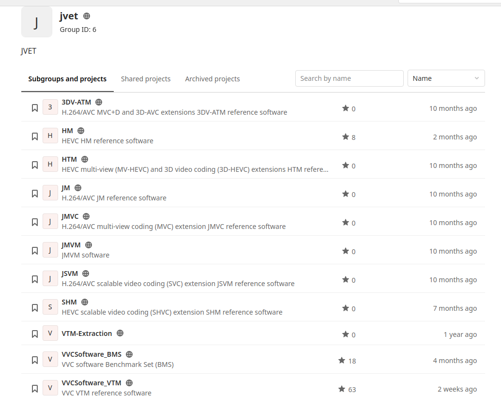

# All related code 
[JVET REPO](https://vcgit.hhi.fraunhofer.de/jvet)

## AVC
[JM-19.0](https://vcgit.hhi.fraunhofer.de/jvet/JM.git)
## SVC
[JSVM_9_19_15](https://vcgit.hhi.fraunhofer.de/jvet/jsvm.git)
## HEVC
[HM-16.24](https://vcgit.hhi.fraunhofer.de/jvet/HM.git)